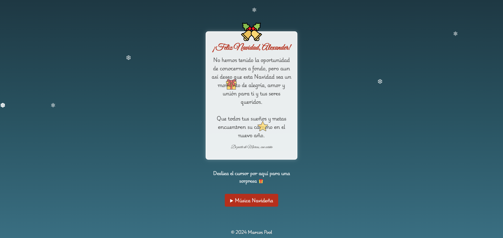
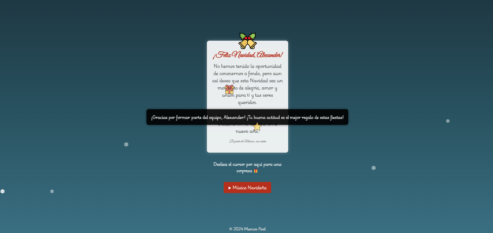
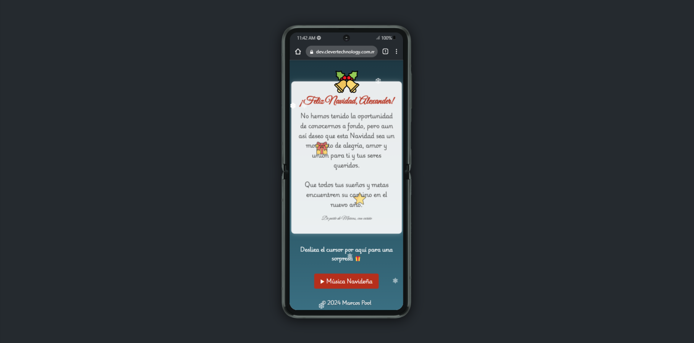

# Tarjeta de Navidad

**Tarjeta de Navidad** es un proyecto interactivo desarrollado para enviar felicitaciones navideñas personalizadas con una experiencia visual atractiva y encantadora. Este proyecto utiliza HTML, CSS y JavaScript para crear una tarjeta navideña animada, incluyendo música y efectos especiales como nieve en pantalla.

## Funcionalidades

- **Mensaje personalizado:** Incluye un mensaje navideño con decoraciones y diseño adaptado al tema festivo.
- **Efectos visuales:** Agrega efectos de nieve animada que caen de manera constante sobre la pantalla.
- **Música navideña:** Botón para reproducir o pausar música festiva.
- **Sorpresa interactiva:** Mensaje oculto que se muestra al interactuar con un elemento específico.

## Características destacadas

- **Diseño responsivo:** Adaptado para verse bien en dispositivos de diferentes tamaños (PC, tablet o smartphone).
- **Animaciones fluidas:** Utiliza GSAP (GreenSock Animation Platform) para movimientos suaves y atractivos.
- **Interactividad enriquecida:** Elementos interactivos para mejorar la experiencia del usuario.
- **Personalizable:** Fácil de modificar para adaptarse a diferentes destinatarios y mensajes.

## Tecnologías utilizadas

- **HTML:** Estructura de la tarjeta.
- **CSS:** Diseño visual, incluyendo animaciones y estilos.
- **JavaScript:** Lógica interactiva y funcionalidad.
- **GSAP:** Plataforma de animación para crear transiciones y movimientos fluidos.

## Herramientas utilizadas

- [HTML5](https://developer.mozilla.org/es/docs/Web/HTML)
- [CSS3](https://developer.mozilla.org/es/docs/Web/CSS)
- [JavaScript](https://developer.mozilla.org/es/docs/Web/JavaScript)
- [GSAP](https://greensock.com/gsap/)

## Capturas de pantalla

### Tarjeta principal

### Mensaje oculto

### Tarjeta en teléfono móvil

## Implementación

### Requisitos

1. Navegador moderno compatible con HTML5, CSS3 y JavaScript.
2. Editor de código como Visual Studio Code para personalizar el proyecto.
3. Carpeta del proyecto con la siguiente estructura:
   - **index.html**: Archivo principal.
   - **styles.css**: Hoja de estilos.
   - **script.js**: Archivo JavaScript.
   - **images/**: Carpeta para imágenes y capturas.
   - **audio/**: Carpeta para archivos de música.

### Uso

1. Clonar el repositorio o descargar los archivos.
2. Abrir el archivo `index.html` en un navegador.
3. Personalizar el mensaje y diseño según las necesidades.
4. Usar el botón de impresión para crear una versión física de la tarjeta.

## Licencia

Este proyecto está bajo la Licencia MIT. Mira el archivo [LICENSE](LICENSE) para más detalles.

## Contacto

Si tienes alguna pregunta o sugerencia, no dudes en abrir un issue o contactar al desarrollador:

- **Nombre:** Marcos Pool
- **Correo electrónico:** <damian.marcospool@gmail.com>
- **GitHub:** [marcosd59](https://github.com/marcosd59)
